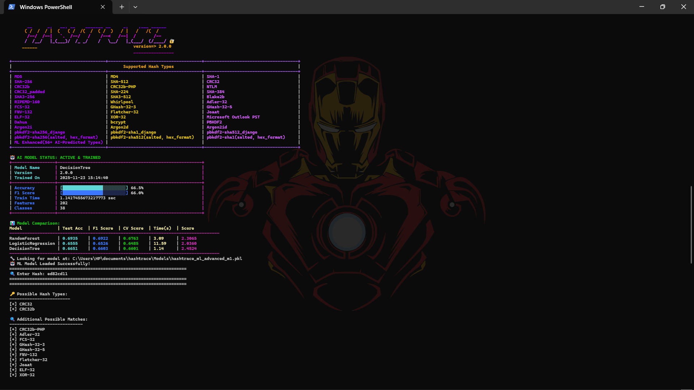

# HASHTRACE 🔍 — Advanced Hash Identifier (AI-Powered)

## 🚀 Modern | AI-Enhanced | MCF-Aware | 100+ Features | CLI + Dataset Generator

HashTrace is a next-generation hash identification system that uses:

✔ Advanced cryptographic feature extraction  
✔ Full MCF support (`$argon2id$`, `$2a$`, `$5$`, `$6$`, etc.)  
✔ Machine Learning classifiers  
✔ Automatic model comparison & selection  
✔ Beautiful CLI with gradients  
✔ Dataset generator for training custom ML models  

---


## ⚠️ Development Warning

The AI model is still in development mode.
Current ML accuracy ranges between 60% to 65%.
Accuracy is expected to increase with the expansion of the training dataset and refinement of generated synthetic data.

## 📌 Features

### 🔥 1. Advanced Hash Feature Extraction
Extracts 100+ features from hash strings:
- Structural patterns  
- Byte-level statistics  
- Bit distribution  
- Encoding detection  
- Cryptographic randomness tests  
- MCF parsing (Argon2, bcrypt, scrypt, SHA512-crypt, etc.)  
- Algorithm-specific fingerprinting  
- And others
  
### 🤖 2. AI-Powered Hash Prediction
Automatically trains and selects the best ML model:
- RandomForest   
- Logistic Regression  
- Decision Tree  

Evaluates:
- Accuracy  
- F1 score  
- Cross-validation  
- Training time  


### 🎨 3. CLI Interface
Includes:
- Neon gradient logo  
- Animated progress bars  
- Color-coded ML stats  
- Error explanations  

---

## 🛠 Installation
```
pip install -r requirements.txt
```
## 🔍 Run HashTrace CLI
```
python hashtrace_ml.py --help
python hashtrace_ml.py --file <File name / path>
```

---

## ⚙️ MCF Detection Support

Supports:
- `$2a$`, `$2b$`, `$2y$` → bcrypt  
- `$argon2i$`, `$argon2d$`, `$argon2id$` → Argon2  
- `$1$` → MD5-crypt  
- `$5$` → SHA256-crypt  
- `$6$` → SHA512-crypt  
- `$scrypt$` → scrypt  
- `$y$` → yescrypt  
- `$8$`, `$9$` → Cisco  
- `$pbkdf2-sha256$` → PBKDF2-SHA256  

---

## 📘 Example Output

```
Enter Hash:
$argon2id$v=19$m=65536,t=3,p=4$1YlQ...$G0PeE...

--------------------------------------------------
Possible Hash Types:
  [+] Argon2id

AI Prediction:
  Argon2id (99.3% confidence)
--------------------------------------------------
```

---

## 📜 License
MIT License
